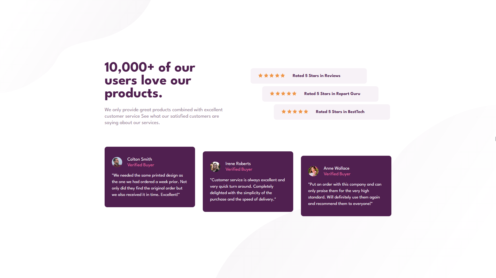
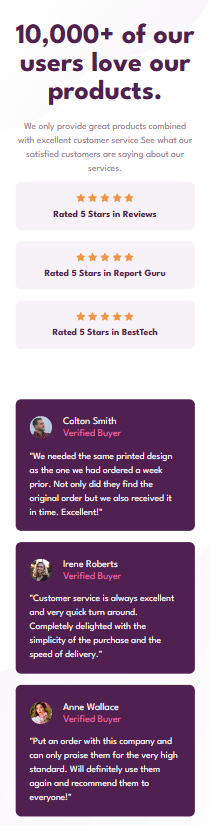

# Frontend Mentor - Social proof section solution

This is a solution to the [Social proof section challenge on Frontend Mentor](https://www.frontendmentor.io/challenges/social-proof-section-6e0qTv_bA). Frontend Mentor challenges help you improve your coding skills by building realistic projects. 

## Overview

### The challenge

Users should be able to:

- View the optimal layout for the section depending on their device's screen size

#### Desktop Screenshot 🖥️

#### Mobile Screenshot 📱

### link 🔗

- Live Site URL: https://lkiryu.github.io/Social-proof-section/

### Built with 🛠️
- HTML5
- CSS
---
### Author 👨‍💻
 Made by Matheus Antonio
